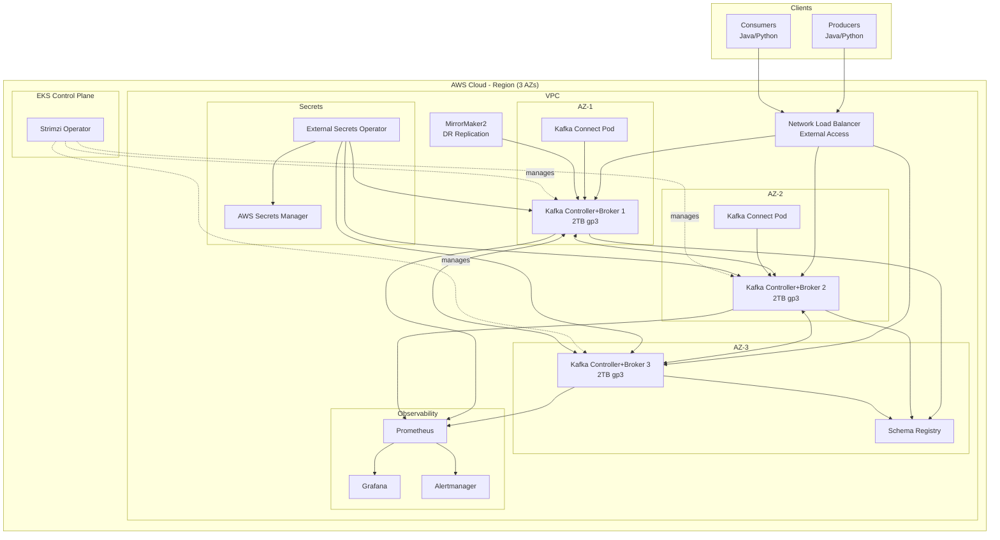

# Production-Grade Apache Kafka Platform

> A complete, enterprise-ready Kafka installation with infrastructure-as-code, security, observability, and operational tooling.

## 🚀 Quick Start (10 minutes)

### Prerequisites
- AWS CLI configured with appropriate credentials
- kubectl v1.27+
- terraform v1.5+
- helm v3.12+
- kustomize v5.0+

### Deploy to Dev Environment

```bash
# 1. Bootstrap infrastructure
make bootstrap-dev

# 2. Deploy Kafka cluster
make deploy-dev

# 3. Run smoke tests
make smoke-test

# 4. Access cluster
export KAFKA_BOOTSTRAP=$(kubectl get kafka dev-kafka -n kafka -o jsonpath='{.status.listeners[?(@.name=="external")].bootstrapServers}')
echo $KAFKA_BOOTSTRAP
```

Expected time: ~8 minutes

## 📋 Table of Contents

- [Architecture Overview](#architecture-overview)
- [Repository Structure](#repository-structure)
- [Platform Features](#platform-features)
- [Deployment Guide](#deployment-guide)
- [Day-2 Operations](#day-2-operations)
- [Security & Compliance](#security--compliance)
- [Troubleshooting](#troubleshooting)

## 🏗️ Architecture Overview

### Platform Configuration

```yaml
Platform: Kubernetes (Strimzi Operator)
Cloud Provider: AWS
Kafka Version: 3.x (KRaft mode - no ZooKeeper)
Deployment: Multi-AZ (3 availability zones)
Brokers: 3 (production), 1 (dev)
Controllers: 3 (production), 1 (dev)
Storage: 2TB gp3/XFS per broker
Security: mTLS + SASL SCRAM-SHA-512
External Access: NLB with per-broker advertised listeners
```

### Architecture Diagram



### Network & Listeners Plan

**KRaft Architecture Benefits:**
- No ZooKeeper dependency - simpler operations
- Faster controller failover (<200ms vs seconds)
- Better scalability (millions of partitions)
- Unified security model

**Listener Configuration:**
```yaml
Internal Listener (PLAINTEXT_INTERNAL):
  - Port: 9092
  - Used by: In-cluster clients (Connect, MirrorMaker2)
  - Security: TLS + SASL SCRAM
  - Network: ClusterIP service

External Listener (EXTERNAL):
  - Port: 9094
  - Used by: External producers/consumers
  - Security: mTLS + SASL SCRAM
  - Network: NLB with per-broker endpoints
  - Advertised hosts: kafka-0.example.com, kafka-1.example.com, kafka-2.example.com
```

**ISR (In-Sync Replicas) Strategy:**
- Replication Factor (RF) = 3
- min.insync.replicas = 2
- unclean.leader.election.enable = false
- Ensures durability: at least 2 replicas acknowledge writes

**Rack Awareness:**
- Each broker assigned to different AZ
- Replicas distributed across AZs for HA
- Survives single AZ failure

## 📁 Repository Structure

```
kafka-platform/
├── README.md                          # This file
├── Makefile                           # Common operational tasks
│
├── docs/                              # Documentation & runbooks
│   ├── architecture.md                # Detailed architecture
│   ├── capacity-planning.md           # Sizing & capacity guide
│   ├── security-model.md              # Security architecture
│   ├── upgrade-strategy.md            # Rolling upgrade procedures
│   ├── runbooks/                      # Operational runbooks
│   │   ├── broker-replacement.md
│   │   ├── disaster-recovery.md
│   │   ├── partition-rebalance.md
│   │   ├── quota-management.md
│   │   └── secret-rotation.md
│   ├── slos/                          # Service Level Objectives
│   │   └── kafka-slos.md
│   └── faqs.md                        # Common questions
│
├── infra/                             # Infrastructure as Code
│   └── terraform/                     # Terraform modules
│       ├── modules/
│       │   ├── networking/            # VPC, subnets, routing
│       │   ├── eks/                   # EKS cluster
│       │   ├── iam/                   # IAM roles & policies
│       │   └── storage/               # EBS configs
│       ├── environments/
│       │   ├── dev/
│       │   ├── stage/
│       │   └── prod/
│       └── backend.tf                 # S3 backend config
│
├── k8s/                               # Kubernetes manifests
│   ├── strimzi/                       # Strimzi operator
│   │   ├── base/
│   │   │   ├── kafka.yaml             # Core Kafka cluster
│   │   │   ├── listeners.yaml         # Listener configs
│   │   │   ├── connect.yaml           # Kafka Connect
│   │   │   ├── schema-registry.yaml   # Schema Registry
│   │   │   ├── mirrormaker2.yaml      # DR replication
│   │   │   └── topic-templates/       # Topic defaults
│   │   ├── overlays/
│   │   │   ├── dev/
│   │   │   ├── stage/
│   │   │   └── prod/
│   │   └── kustomization.yaml
│   ├── external-secrets/              # External Secrets Operator
│   │   ├── secret-stores.yaml
│   │   └── external-secrets.yaml
│   └── monitoring/                    # Observability stack
│       ├── prometheus/
│       ├── grafana/
│       └── alertmanager/
│
├── scripts/                           # Admin & operational tools
│   ├── admin/
│   │   ├── create-topic.sh            # Topic management
│   │   ├── manage-acls.sh             # ACL operations
│   │   ├── set-quotas.sh              # Quota management
│   │   ├── reassign-partitions.py     # Partition rebalancing
│   │   └── preferred-leader.sh        # Leader election
│   ├── bootstrap/
│   │   ├── init-cluster.sh            # Initial cluster setup
│   │   └── create-users.sh            # SCRAM user creation
│   └── testing/
│       ├── perf-test.sh               # Performance testing
│       ├── chaos-drill.sh             # Chaos engineering
│       └── smoke-test.sh              # Health checks
│
├── clients/                           # Sample client applications
│   ├── java/
│   │   ├── producer-example/
│   │   └── consumer-example/
│   ├── python/
│   │   ├── producer_example.py
│   │   └── consumer_example.py
│   └── perf-tests/
│       └── load-generator.py
│
├── observability/                     # Monitoring configurations
│   ├── dashboards/                    # Grafana dashboards
│   │   ├── kafka-overview.json
│   │   ├── broker-metrics.json
│   │   ├── consumer-lag.json
│   │   └── connect-metrics.json
│   ├── alerts/                        # Prometheus alert rules
│   │   ├── broker-alerts.yaml
│   │   ├── topic-alerts.yaml
│   │   └── connect-alerts.yaml
│   └── jmx-exporter/
│       ├── kafka-broker.yaml          # JMX config for brokers
│       ├── kafka-connect.yaml
│       └── schema-registry.yaml
│
└── .github/
    └── workflows/                     # CI/CD pipelines
        ├── lint.yaml                  # Linting checks
        ├── terraform-plan.yaml        # Infrastructure planning
        ├── terraform-apply.yaml       # Infrastructure deployment
        ├── deploy-kafka.yaml          # Kafka deployment
        └── security-scan.yaml         # Security scanning
```

## 🎯 Platform Features

### Security
- ✅ mTLS encryption for all communication
- ✅ SASL SCRAM-SHA-512 authentication
- ✅ Fine-grained ACLs (least privilege)
- ✅ Client quotas per tenant
- ✅ Secret rotation automation
- ✅ External Secrets Operator integration
- ✅ Network policies & security groups
- ✅ Audit logging enabled

### High Availability
- ✅ Multi-AZ deployment (3 zones)
- ✅ KRaft mode (no ZooKeeper)
- ✅ Rack-aware replica placement
- ✅ RF=3, min.insync.replicas=2
- ✅ Automated leader election
- ✅ MirrorMaker2 for DR

### Observability
- ✅ Prometheus metrics collection
- ✅ Grafana dashboards (4 pre-configured)
- ✅ Alertmanager for notifications
- ✅ JMX exporter on all components
- ✅ Consumer lag monitoring
- ✅ Under-replicated partition alerts
- ✅ Disk usage monitoring

### Operations
- ✅ Infrastructure as Code (Terraform)
- ✅ GitOps-ready (Kustomize overlays)
- ✅ Automated CI/CD (GitHub Actions)
- ✅ Admin CLI tools
- ✅ Chaos engineering scripts
- ✅ Performance testing suite
- ✅ Comprehensive runbooks

## 🚢 Deployment Guide

### Infrastructure Deployment

```bash
# 1. Configure AWS credentials
export AWS_PROFILE=your-profile
export AWS_REGION=us-east-1

# 2. Deploy infrastructure (Terraform)
cd infra/terraform/environments/dev
terraform init
terraform plan -out=tfplan
terraform apply tfplan

# 3. Configure kubectl
aws eks update-kubeconfig --name dev-kafka-cluster --region us-east-1

# 4. Install Strimzi operator
make install-strimzi

# 5. Deploy External Secrets Operator
make install-external-secrets
```

### Kafka Cluster Deployment

```bash
# Dev environment (single node, suitable for testing)
make deploy-dev

# Stage environment (3 nodes, production-like)
make deploy-stage

# Production environment (3 nodes, full HA)
make deploy-prod
```

### Post-Deployment Validation

```bash
# Check cluster status
kubectl get kafka -n kafka

# Verify brokers are ready
kubectl get pods -n kafka -l app.kubernetes.io/name=kafka

# Run smoke tests
make smoke-test

# Check metrics
kubectl port-forward -n monitoring svc/grafana 3000:80
# Visit http://localhost:3000
```

## 🔧 Day-2 Operations

### Topic Management

```bash
# Create topic with defaults (RF=3, min.isr=2)
./scripts/admin/create-topic.sh --name orders --partitions 12

# List all topics
./scripts/admin/create-topic.sh --list

# Increase partitions
./scripts/admin/create-topic.sh --name orders --partitions 24 --alter

# Delete topic
./scripts/admin/create-topic.sh --name orders --delete
```

### ACL Management

```bash
# Grant producer access
./scripts/admin/manage-acls.sh --user app-producer \
  --topic orders --operation WRITE

# Grant consumer access
./scripts/admin/manage-acls.sh --user app-consumer \
  --topic orders --group order-processors --operation READ

# List ACLs
./scripts/admin/manage-acls.sh --list
```

### Quota Management

```bash
# Set producer quota (10 MB/s)
./scripts/admin/set-quotas.sh --user app-producer \
  --producer-byte-rate 10485760

# Set consumer quota (20 MB/s)
./scripts/admin/set-quotas.sh --user app-consumer \
  --consumer-byte-rate 20971520

# View quotas
./scripts/admin/set-quotas.sh --describe
```

### Monitoring & Alerts

```bash
# Access Grafana
kubectl port-forward -n monitoring svc/grafana 3000:80

# Access Prometheus
kubectl port-forward -n monitoring svc/prometheus 9090:9090

# View active alerts
kubectl port-forward -n monitoring svc/alertmanager 9093:9093
```

### Scaling Operations

```bash
# Scale brokers (modify kafka.yaml replicas)
kubectl edit kafka prod-kafka -n kafka

# Trigger partition reassignment
./scripts/admin/reassign-partitions.py --broker-id 3 --generate

# Verify reassignment progress
./scripts/admin/reassign-partitions.py --verify
```

### Upgrade Procedure

```bash
# See docs/upgrade-strategy.md for details

# 1. Rolling restart (config changes)
kubectl annotate kafka prod-kafka -n kafka \
  strimzi.io/manual-rolling-update=true

# 2. Version upgrade
# Edit kafka.yaml to new version
kubectl apply -k k8s/strimzi/overlays/prod
```

### Disaster Recovery

```bash
# Check MirrorMaker2 replication lag
kubectl logs -n kafka -l app.kubernetes.io/name=mirrormaker2

# Failover to DR cluster (see docs/runbooks/disaster-recovery.md)
./scripts/dr/failover-to-dr.sh --dry-run
./scripts/dr/failover-to-dr.sh --execute
```

## 🔐 Security & Compliance

### Authentication & Authorization

- **SASL SCRAM-SHA-512**: All clients must authenticate
- **mTLS**: All broker-to-broker and client-to-broker communication encrypted
- **ACLs**: Enforced for all topics and consumer groups
- **Quotas**: Per-user rate limiting to prevent abuse

### Secret Management

```bash
# Secrets stored in AWS Secrets Manager
# External Secrets Operator syncs to Kubernetes

# Rotate SCRAM credentials
./scripts/bootstrap/create-users.sh --rotate --user app-producer

# Rotate TLS certificates (automatic via cert-manager)
kubectl delete secret kafka-cluster-ca-cert -n kafka
# Strimzi will regenerate
```

### Audit Logging

```bash
# View audit logs
kubectl logs -n kafka kafka-prod-0 | grep AuditLog

# Export to CloudWatch (configured via Fluentd)
```

## 🛠️ Troubleshooting

### Common Issues

**Broker not starting:**
```bash
kubectl logs -n kafka kafka-prod-0 -c kafka
kubectl describe pod -n kafka kafka-prod-0
```

**Under-replicated partitions:**
```bash
./scripts/admin/check-isr.sh
./scripts/admin/reassign-partitions.py --verify
```

**Consumer lag:**
```bash
kubectl exec -n kafka kafka-prod-0 -c kafka -- bin/kafka-consumer-groups.sh \
  --bootstrap-server localhost:9092 \
  --describe --group my-group
```

**Connection issues:**
```bash
# Test internal connectivity
kubectl run -it --rm kafka-test --image=confluentinc/cp-kafka:7.5.0 \
  --restart=Never -- bash
# Inside pod:
kafka-broker-api-versions --bootstrap-server kafka-bootstrap:9092

# Test external connectivity
kafkacat -b $EXTERNAL_BOOTSTRAP -L
```

### Health Checks

```bash
# Quick health check
make health-check

# Detailed diagnostics
./scripts/testing/diagnose.sh

# Run chaos drill
./scripts/testing/chaos-drill.sh --kill-broker
```

## 📊 Capacity Planning

**Cheat Sheet:**
```
Partitions per topic: 12-24 (divisible by # brokers)
Max partitions per broker: ~4,000
Throughput per partition: ~10-100 MB/s
Recommended RF: 3 (production), 2 (dev/stage)
Min ISR: RF - 1 (allows 1 replica down)
Retention: 7 days (configurable per topic)
Segment size: 1 GB (default)
Log compaction: Enabled for system topics
```

**Sizing Example (100 MB/s ingress):**
- 3 brokers × 2 TB storage = 6 TB total
- ~7 days retention at 100 MB/s = ~60 TB (use compression)
- Expected compression ratio: 3-5x
- Actual storage needed: ~15-20 TB (add 30% buffer)

See [docs/capacity-planning.md](docs/capacity-planning.md) for detailed calculations.

## 📚 Additional Resources

- [Strimzi Documentation](https://strimzi.io/docs/operators/latest/overview.html)
- [Kafka KRaft Mode](https://kafka.apache.org/documentation/#kraft)
- [Runbooks](docs/runbooks/)
- [SLOs & SLAs](docs/slos/)
- [FAQs](docs/faqs.md)

## 🤝 Contributing

See [CONTRIBUTING.md](CONTRIBUTING.md) for guidelines.

## 📄 License

Apache License 2.0 - See [LICENSE](../LICENSE) for details.

## 🆘 Support

For issues and questions:
1. Check [docs/faqs.md](docs/faqs.md)
2. Review [runbooks](docs/runbooks/)
3. Open a GitHub issue

---

**Status Badges:**


